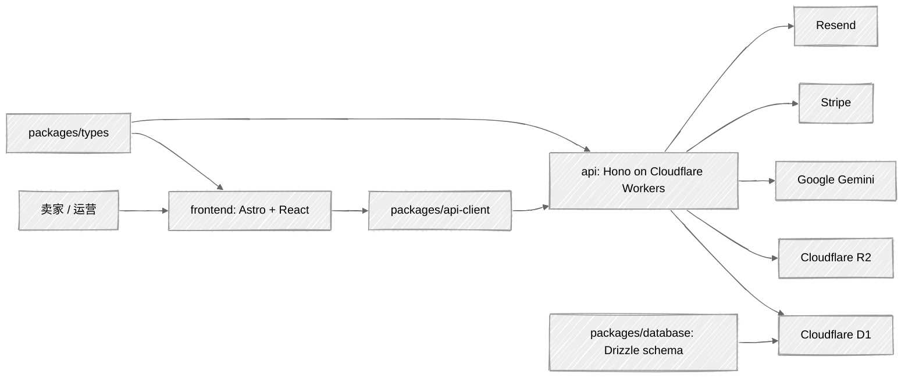

# OuraPix

<p align="center">
  
</p>

<p align="center">
  <strong>AI 驱动的跨境电商商品详情页生成器</strong><br />
  把商品输入转成平台可用的文案、视觉方向、详情页素材和管理流程。
</p>

<p align="center">
  <a href="#项目范围">项目范围</a> ·
  <a href="#快速开始">快速开始</a> ·
  <a href="#架构">架构</a> ·
  <a href="#常用命令">常用命令</a> ·
  <a href="#文档索引">文档索引</a>
</p>

## 项目范围

OuraPix 面向 Amazon、Shopify、eBay、Etsy 等跨境电商场景，围绕商品详情页生成、图片资产管理、浏览器内图片处理、团队协作和 API 访问构建。当前仓库是 Cloudflare 原生部署的 pnpm/turbo monorepo。

当前产品面包含：

- 商品详情生成：当前 Worker 生成文案/内容变体，图片生成字段保留为兼容状态。
- 资产管理：生成历史、收藏、收藏夹、图片对比、统计和通知。
- 图片编辑：裁剪、旋转、翻转、色彩调整、锐化和水印。
- 浏览器工具：去背景、局部抠图、拼图、批量处理、智能边框和导出预设。
- 开放能力：API Key 访问、团队协作和角色管理。
- 本地演示：未配置 `GEMINI_API_KEY` 时，API 会返回 demo 文案，方便本地冒烟。

产品细节见 [docs/PRODUCT.md](./docs/PRODUCT.md)，API 说明见 [docs/API.md](./docs/API.md)。

## 快速开始

环境要求：

- Node.js `>=18.0.0`
- pnpm `9.x`
- Cloudflare 账号，用于 D1、R2 和 Workers 开发
- 可选服务密钥：Gemini、Stripe、Resend、OAuth providers

```bash
pnpm install

cp api/.dev.vars.example api/.dev.vars
cp frontend/.env.local.example frontend/.env.local

pnpm db:migrate:local
pnpm dev
```

默认本地地址：

| 服务 | 地址 |
| --- | --- |
| Frontend | `http://localhost:4321` |
| API | `http://localhost:8989` |

本地启动前可先检查配置：

```bash
pnpm debug:check
```

完整本地测试流程见 [docs/LOCAL_TESTING.md](./docs/LOCAL_TESTING.md)。

## 架构

OuraPix 的运行边界保持清晰：Astro 负责浏览器体验，Hono 负责 API，`packages/*` 提供 API client、数据库、配置和共享类型。



仓库结构：

```text
oura-pix/
├── api/                    # Hono + Cloudflare Workers API
├── frontend/               # Astro 5 frontend with React islands
├── packages/
│   ├── api-client/         # 前端 HTTP client
│   ├── config/             # 共享配置
│   ├── database/           # Drizzle schema 和迁移命令
│   └── types/              # 共享 TypeScript 类型
├── drizzle/migrations/     # 当前 D1 迁移源
├── docs/                   # 产品、API、本地测试和参考文档
├── public/                 # 共享品牌资源
└── turbo.json
```

## 常用命令

| 范围 | 命令 | 用途 |
| --- | --- | --- |
| Root | `pnpm dev` | 通过 Turbo 同时运行 API 和前端 |
| Root | `pnpm build` | 构建所有包 |
| Root | `pnpm lint` | 运行 workspace lint |
| Root | `pnpm typecheck` | 运行 workspace 类型检查 |
| Root | `pnpm test` | 以 Vitest run 模式运行 API 测试 |
| Root | `pnpm verify` | 依次运行 lint、typecheck、test、build |
| API | `pnpm api:dev` | 在 `8989` 端口运行 Worker |
| API | `pnpm --filter=@oura-pix/api test` | 运行 API 测试 |
| API | `pnpm --filter=@oura-pix/api typecheck` | 检查 API 类型 |
| Frontend | `pnpm web:dev` | 运行 Astro dev server |
| Frontend | `pnpm --filter=@oura-pix/frontend build` | 构建前端 |
| Frontend | `pnpm --filter=@oura-pix/frontend typecheck` | 检查前端类型 |
| Database | `pnpm db:generate` | 生成 Drizzle 迁移 |
| Database | `pnpm db:migrate:local` | 应用本地 D1 迁移 |
| Database | `pnpm db:migrate:prod` | 应用远端 D1 迁移 |
| Database | `pnpm db:studio` | 打开 Drizzle Studio |

## 配置

本地开发使用包级环境文件：

| 文件 | 用途 |
| --- | --- |
| `api/.dev.vars` | Worker secrets 和 API 侧本地变量 |
| `frontend/.env.local` | 前端可暴露变量 |
| `api/wrangler.jsonc` | API Worker、D1、R2 和运行时变量 |
| `frontend/wrangler.toml` | 前端 Worker 和静态资源配置 |

关键变量：

- `BETTER_AUTH_SECRET`, `BETTER_AUTH_URL`, `NEXT_PUBLIC_APP_URL`
- `PUBLIC_API_URL`
- `GEMINI_API_KEY`, `GEMINI_BASE_URL`, `GEMINI_MODEL`
- `STRIPE_SECRET_KEY`, `STRIPE_WEBHOOK_SECRET`
- `RESEND_API_KEY`, `FROM_EMAIL`, `FROM_NAME`
- `CLOUDFLARE_R2_PUBLIC_URL`

当前 API 配置中的 Cloudflare bindings：

| Binding | 资源 |
| --- | --- |
| `DB` | `oura-pix-db` |
| `R2` | `oura-pix-r2` |

生产 secrets 必须通过 Wrangler 或 Cloudflare Dashboard 管理，不能提交到仓库。

## 开发约定

- 前端请求应经过 [frontend/src/lib/api.ts](./frontend/src/lib/api.ts)，确保 `PUBLIC_API_URL` 生效。
- 当前迁移源在 [drizzle/migrations](./drizzle/migrations)，API config 指向该目录。
- 生产数据库迁移需要明确的人类授权。
- `/api/v1/*` 使用 API Key 认证，`/api/webhooks/stripe` 使用 Stripe 签名校验。
- 不要把 Gemini、Stripe、OAuth、Better Auth 或 Cloudflare secrets 写入文档、提交或公开聊天。

## 文档索引

| 文档 | 用途 |
| --- | --- |
| [docs/PRODUCT.md](./docs/PRODUCT.md) | 产品能力、页面和使用场景 |
| [docs/LOCAL_TESTING.md](./docs/LOCAL_TESTING.md) | 本地环境和可重复冒烟流程 |
| [docs/DEVELOPMENT.md](./docs/DEVELOPMENT.md) | 开发背景和项目结构 |
| [docs/API.md](./docs/API.md) | REST API 端点和示例 |
| [docs/reference/design.md](./docs/reference/design.md) | 设计系统说明 |
| [CLAUDE.md](./CLAUDE.md) | Agent 规则和仓库注意事项 |

## License

[MIT](./LICENSE)
