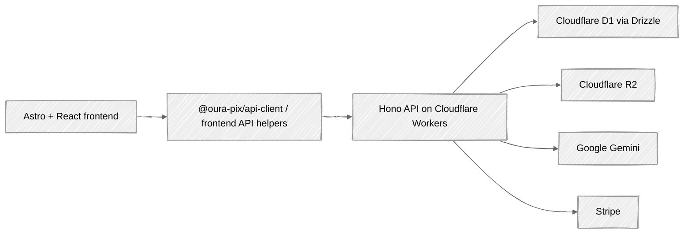

# OuraPix Development Guide

This guide describes the current repository shape. Historical migration notes for removed frontend and image-generation implementations were deleted because they no longer match the codebase.

## Architecture



## Packages

| Path | Purpose |
|------|---------|
| `api/` | Hono Worker entrypoint, routes, middleware, and service layer |
| `frontend/` | Astro pages, React components, hooks, styles, and local messages |
| `packages/database/` | Drizzle schema, migrations config, and `createDb` helper |
| `packages/types/` | Browser-safe shared DTOs and domain types |
| `packages/api-client/` | Shared HTTP client primitives |
| `packages/config/` | Shared TypeScript/Turbo config |
| `drizzle/migrations/` | D1 migration SQL and Drizzle metadata |
| `scripts/` | Local maintenance scripts |

## Local Development

Use the runbook in [Local Testing](./LOCAL_TESTING.md) for the exact setup flow.

```bash
pnpm install --frozen-lockfile

cp api/.dev.vars.example api/.dev.vars
cp frontend/.env.local.example frontend/.env.local

pnpm debug:check
pnpm db:migrate:local
```

Run services in two terminals:

```bash
pnpm api:dev
```

```bash
pnpm web:dev
```

Default local endpoints:

- API Worker: `http://localhost:8989`
- Frontend: `http://localhost:4321`

## Root Commands

| Command | Purpose |
|---------|---------|
| `pnpm dev` | Run all workspace dev tasks through Turbo |
| `pnpm api:dev` | Start the API Worker locally |
| `pnpm web:dev` | Start the Astro frontend |
| `pnpm lint` | Run workspace lint tasks |
| `pnpm typecheck` | Run workspace type checks |
| `pnpm test` | Run API tests with Vitest |
| `pnpm build` | Build all packages |
| `pnpm verify` | Run lint, typecheck, test, and build |
| `pnpm db:generate` | Generate Drizzle migrations |
| `pnpm db:migrate:local` | Apply D1 migrations to local Wrangler state |
| `pnpm db:migrate:prod` | Apply D1 migrations remotely |
| `pnpm clean:state` | Remove local Wrangler state |

## API Development

API routes live under `api/src/routes/` and are registered in `api/src/index.ts`.

The main route groups are:

- `auth.ts`, `user.ts`
- `generations.ts`, `v1/generate.ts`
- `upload.ts`, `favorites.ts`, `collections.ts`
- `stats.ts`, `metrics.ts`, `errors.ts`
- `keys.ts`, `teams.ts`, `competitors.ts`, `feedback.ts`, `categories.ts`
- `webhooks/stripe.ts`

Business logic belongs in `api/src/services/`. Database access should go through `createDb` and `schema` from `@oura-pix/database`.

## Generation Pipeline

The current Worker pipeline:

1. Creates a `generations` row with status `pending`.
2. Processes the task asynchronously through `processGeneration`.
3. Calls `generateProductCopy` in `api/src/services/geminiService.ts`.
4. Stores text/content variants in `generations.results`.
5. Marks `imageGenerationStatus` as `skipped` because image generation is not configured in the current Worker pipeline.

When `GEMINI_API_KEY` is empty, the service returns deterministic demo copy for local smoke testing.

## Frontend Development

Astro pages live in `frontend/src/pages/` and mount React components from `frontend/src/components/`.

Important frontend paths:

- `frontend/src/lib/api.ts` centralizes API base URL and request helpers.
- `frontend/src/lib/generation.ts` wraps generation calls.
- `frontend/src/hooks/` contains page-specific data hooks.
- `frontend/src/styles/globals.css` defines Tailwind 4 theme variables and shared utility classes.
- `frontend/messages/*.json` and `frontend/src/paraglide/messages.js` provide the current local message layer.

## Database

Schema definitions live in `packages/database/src/schema.ts`.

Migrations are generated by `packages/database/drizzle.config.ts` and applied through `api/wrangler.jsonc`, which points D1 migrations at `../drizzle/migrations`.

```bash
pnpm db:generate
pnpm db:migrate:local
pnpm db:migrate:prod
```

## Deployment

GitHub Actions deploys from `main`:

- `.github/workflows/api-deploy.yml` deploys `api/` to Cloudflare Workers.
- `.github/workflows/deploy.yml` builds and deploys `frontend/` to Cloudflare Workers.
- `.github/workflows/pr-validation.yml` runs build, lint, and typecheck for PRs.

Manual deploy commands:

```bash
pnpm db:migrate:prod
pnpm api:deploy
pnpm web:deploy
```

Production secrets are managed in Cloudflare. Use Worker secrets or dashboard variables for sensitive values such as auth, Stripe, Resend, OAuth, and Gemini keys.

## Quality Gates

Run before handing off code:

```bash
pnpm verify
```

For API-only work:

```bash
pnpm --filter=@oura-pix/api lint
pnpm --filter=@oura-pix/api typecheck
pnpm --filter=@oura-pix/api test -- --run
```

For frontend-only work:

```bash
pnpm --filter=@oura-pix/frontend lint
pnpm --filter=@oura-pix/frontend typecheck
pnpm --filter=@oura-pix/frontend build
```

## Documentation Rules

- Keep docs aligned to current package names and root scripts.
- Do not document removed legacy app paths, deleted build outputs, or deleted one-off test scripts.
- Prefer `docs/LOCAL_TESTING.md` for local setup details and keep this file focused on architecture and development conventions.
