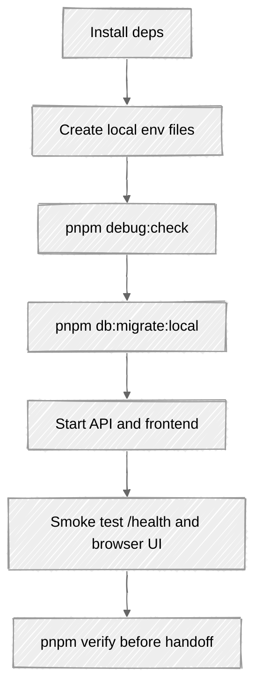

# Local Testing

This runbook defines the local environment and repeatable test flow for OuraPix.

## Assumptions

- Run commands from the repository root.
- Use Node.js 18 or newer and pnpm 9 or newer.
- Local API runs on `http://localhost:8989`.
- Local frontend runs on `http://localhost:4321`.
- Gemini can be left unconfigured for local smoke testing; the API returns demo copy when `GEMINI_API_KEY` is empty.

## One-Time Setup

```bash
pnpm install --frozen-lockfile

cp api/.dev.vars.example api/.dev.vars
cp frontend/.env.local.example frontend/.env.local
```

Edit `api/.dev.vars` only when you need real third-party integrations. For basic local testing, the checked-in example values are enough except for flows that call Stripe, OAuth, Resend, or real Gemini.

## Environment Check

```bash
pnpm debug:check
```

This verifies the current monorepo paths:

- `api/wrangler.jsonc`
- `api/.dev.vars`
- `frontend/wrangler.toml`
- `frontend/.env.local`
- `drizzle/migrations`

## Database

Apply D1 migrations to Wrangler's local state:

```bash
pnpm db:migrate:local
```

If local state becomes inconsistent, reset it and apply migrations again:

```bash
pnpm clean:state
pnpm db:migrate:local
```

## Start Services

Use two terminals:

```bash
pnpm api:dev
```

```bash
pnpm web:dev
```

Smoke check:

```bash
curl -s http://localhost:8989/health
open http://localhost:4321
```

## Automated Gates

Run the standard local gate before handing off a change:

```bash
pnpm verify
```

`pnpm verify` runs:

1. `pnpm lint`
2. `pnpm typecheck`
3. `pnpm test`
4. `pnpm build`

For a faster API-only loop:

```bash
pnpm --filter=@oura-pix/api lint
pnpm --filter=@oura-pix/api typecheck
pnpm --filter=@oura-pix/api test -- --run
```

## Flow



## Manual Browser Checklist

Use [frontend/TESTING.md](../frontend/TESTING.md) after the automated gates pass. Keep manual checks focused on flows touched by the change.
